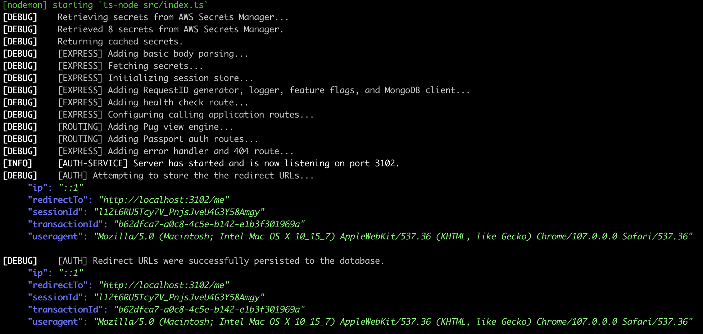

# wistful

[](https://www.npmjs.com/package/wistful)
[](https://dl.circleci.com/status-badge/redirect/gh/ChrisCarleton/wistful/tree/master)
[](https://coveralls.io/github/ChrisCarleton/wistful?branch=master)

A handy tool for pretty-printing the JSON-formatted output from your Winston logs.



## Usage

Install globally

```bash
npm install -g wistful

# or

yarn global add wistful
```

Then you can pipe log files...

```bash
wistful < logs.txt
```

Or even pipe the log output from your apps in real-time...

```bash
node src/index.js | wistful
```
